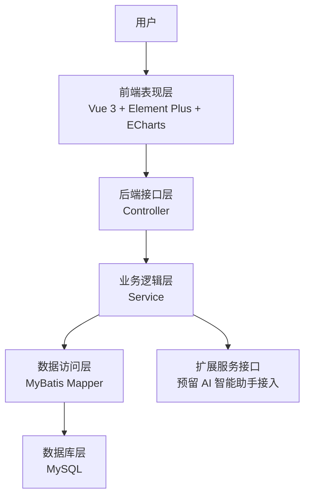
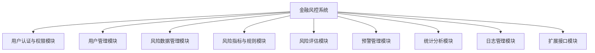
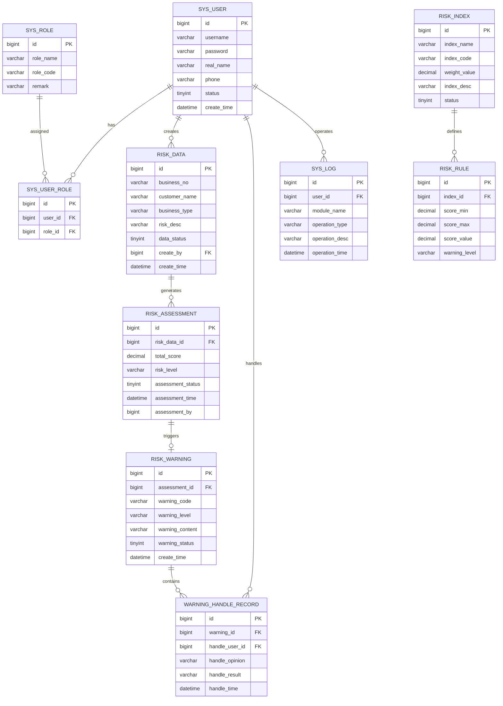
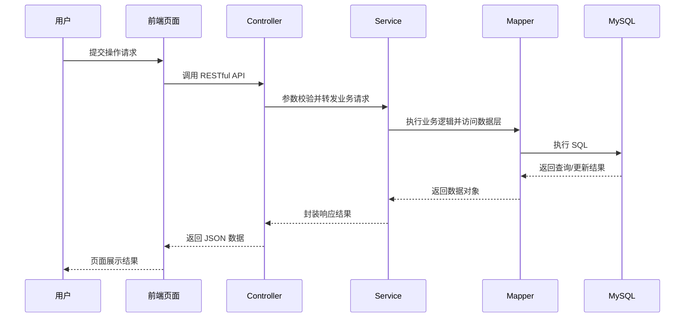
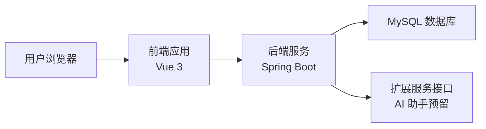
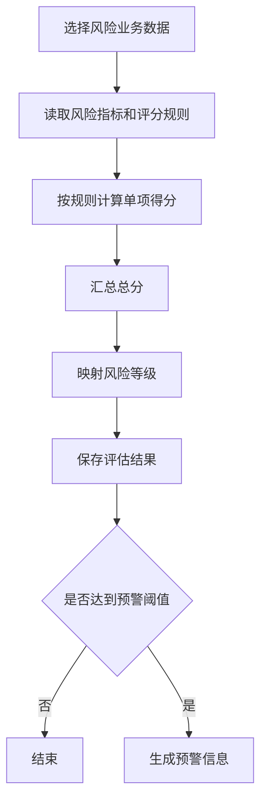

# 技术方案图示 Mermaid 代码

## 1. 系统总体架构图

```mermaid
flowchart TD
    U[用户] --> F[前端表现层\nVue 3 + Element Plus + ECharts]
    F --> C[后端接口层\nController]
    C --> S[业务逻辑层\nService]
    S --> M[数据访问层\nMyBatis Mapper]
    M --> D[数据库层\nMySQL]
    S --> X[扩展服务接口\n预留 AI 智能助手接入]
```

## 2. 系统功能模块图

```mermaid
flowchart TD
    A[金融风控系统]
    A --> B[用户认证与权限模块]
    A --> C[用户管理模块]
    A --> D[风险数据管理模块]
    A --> E[风险指标与规则模块]
    A --> F[风险评估模块]
    A --> G[预警管理模块]
    A --> H[统计分析模块]
    A --> I[日志管理模块]
    A --> J[扩展接口模块]
```

## 3. 数据库 ER 图

```mermaid
erDiagram
    SYS_USER ||--o{ SYS_USER_ROLE : has
    SYS_ROLE ||--o{ SYS_USER_ROLE : assigned
    SYS_USER ||--o{ RISK_DATA : creates
    RISK_INDEX ||--o{ RISK_RULE : defines
    RISK_DATA ||--o{ RISK_ASSESSMENT : generates
    RISK_ASSESSMENT ||--o| RISK_WARNING : triggers
    RISK_WARNING ||--o{ WARNING_HANDLE_RECORD : contains
    SYS_USER ||--o{ WARNING_HANDLE_RECORD : handles
    SYS_USER ||--o{ SYS_LOG : operates

    SYS_USER {
        bigint id PK
        varchar username
        varchar password
        varchar real_name
        varchar phone
        tinyint status
        datetime create_time
    }

    SYS_ROLE {
        bigint id PK
        varchar role_name
        varchar role_code
        varchar remark
    }

    SYS_USER_ROLE {
        bigint id PK
        bigint user_id FK
        bigint role_id FK
    }

    RISK_DATA {
        bigint id PK
        varchar business_no
        varchar customer_name
        varchar business_type
        varchar risk_desc
        tinyint data_status
        bigint create_by FK
        datetime create_time
    }

    RISK_INDEX {
        bigint id PK
        varchar index_name
        varchar index_code
        decimal weight_value
        varchar index_desc
        tinyint status
    }

    RISK_RULE {
        bigint id PK
        bigint index_id FK
        decimal score_min
        decimal score_max
        decimal score_value
        varchar warning_level
    }

    RISK_ASSESSMENT {
        bigint id PK
        bigint risk_data_id FK
        decimal total_score
        varchar risk_level
        tinyint assessment_status
        datetime assessment_time
        bigint assessment_by
    }

    RISK_WARNING {
        bigint id PK
        bigint assessment_id FK
        varchar warning_code
        varchar warning_level
        varchar warning_content
        tinyint warning_status
        datetime create_time
    }

    WARNING_HANDLE_RECORD {
        bigint id PK
        bigint warning_id FK
        bigint handle_user_id FK
        varchar handle_opinion
        varchar handle_result
        datetime handle_time
    }

    SYS_LOG {
        bigint id PK
        bigint user_id FK
        varchar module_name
        varchar operation_type
        varchar operation_desc
        datetime operation_time
    }
```

## 4. 接口交互图

```mermaid
sequenceDiagram
    participant User as 用户
    participant Front as 前端页面
    participant Controller as Controller
    participant Service as Service
    participant Mapper as Mapper
    participant DB as MySQL

    User->>Front: 提交操作请求
    Front->>Controller: 调用 RESTful API
    Controller->>Service: 参数校验并转发业务请求
    Service->>Mapper: 执行业务逻辑并访问数据层
    Mapper->>DB: 执行 SQL
    DB-->>Mapper: 返回查询/更新结果
    Mapper-->>Service: 返回数据对象
    Service-->>Controller: 封装响应结果
    Controller-->>Front: 返回 JSON 数据
    Front-->>User: 页面展示结果
```

## 5. 部署图

```mermaid
flowchart LR
    A[用户浏览器] --> B[前端应用\nVue 3]
    B --> C[后端服务\nSpring Boot]
    C --> D[MySQL 数据库]
    C --> E[扩展服务接口\nAI 助手预留]
```

## 6. 风险评估模块流程图

```mermaid
flowchart TD
    A[选择风险业务数据] --> B[读取风险指标和评分规则]
    B --> C[按规则计算单项得分]
    C --> D[汇总总分]
    D --> E[映射风险等级]
    E --> F[保存评估结果]
    F --> G{是否达到预警阈值}
    G -- 否 --> H[结束]
    G -- 是 --> I[生成预警信息]
```
