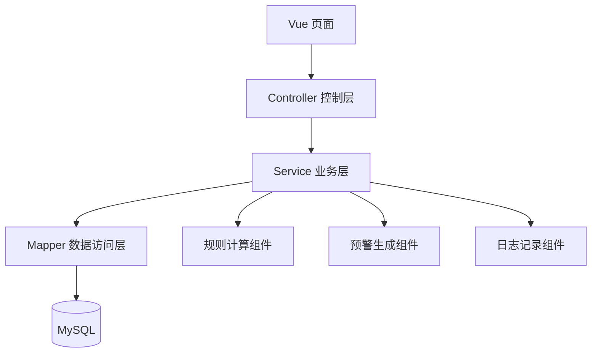
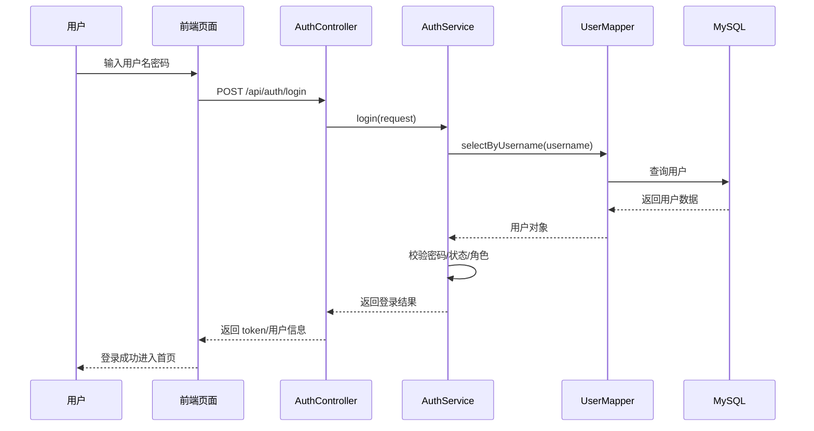
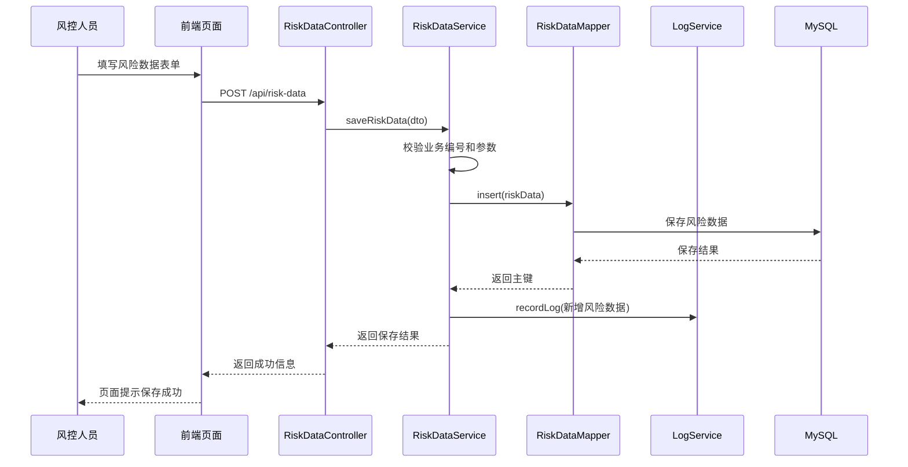
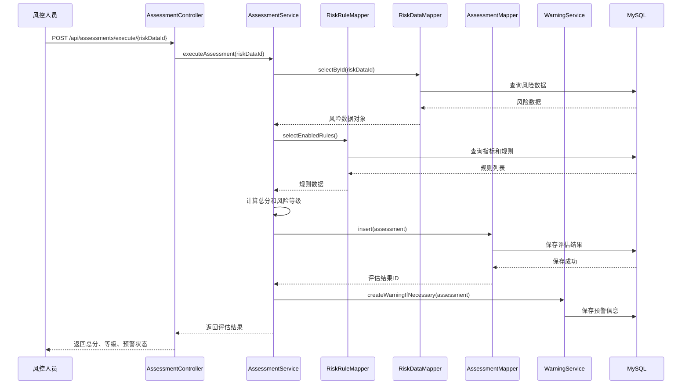
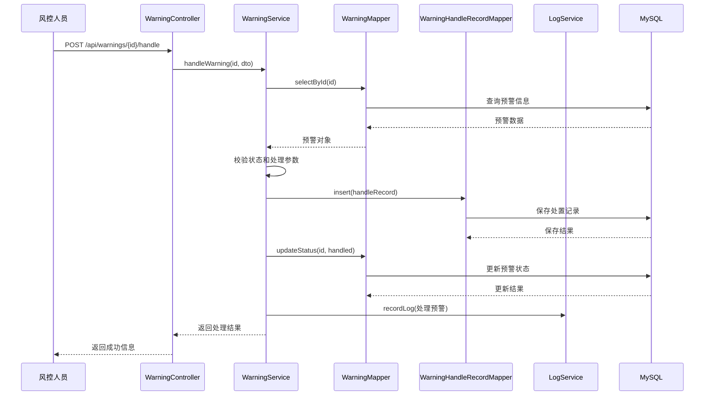
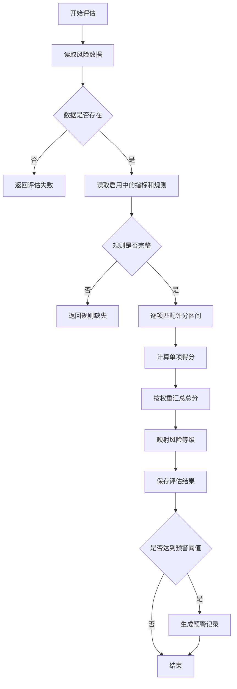
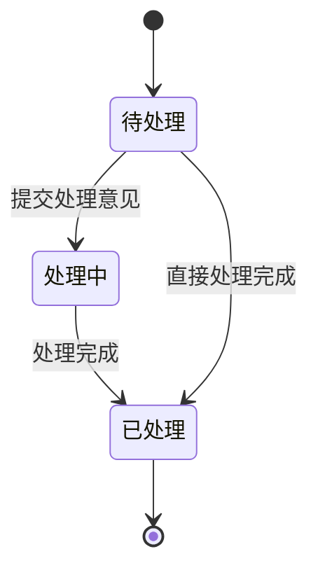
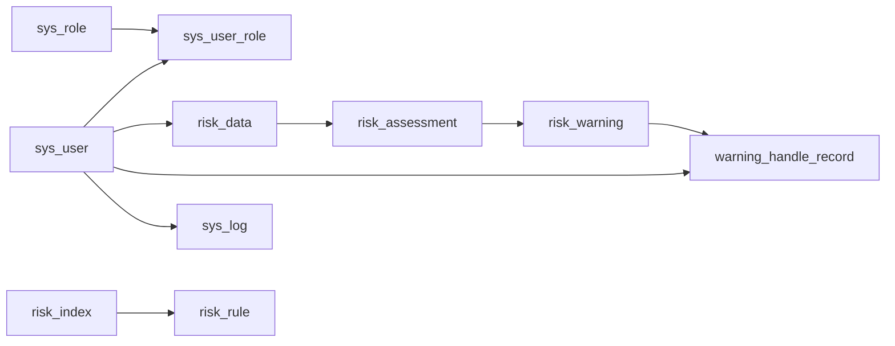
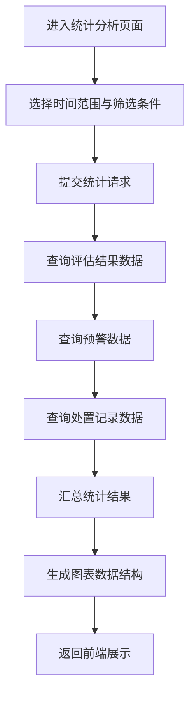

# 详细设计图示 Mermaid 代码

## 1. 后端分层调用图

```mermaid
flowchart TD
    A[Vue 页面] --> B[Controller 控制层]
    B --> C[Service 业务层]
    C --> D[Mapper 数据访问层]
    D --> E[(MySQL)]
    C --> F[规则计算组件]
    C --> G[预警生成组件]
    C --> H[日志记录组件]
```

## 2. 项目代码结构图

```mermaid
flowchart TD
    A[src/main/java/com/cmj/risk]
    A --> B[controller]
    A --> C[service]
    A --> D[service/impl]
    A --> E[mapper]
    A --> F[entity]
    A --> G[dto]
    A --> H[vo]
    A --> I[config]
    A --> J[common]
    A --> K[utils]

    B --> B1[AuthController]
    B --> B2[UserController]
    B --> B3[RiskDataController]
    B --> B4[RiskIndexController]
    B --> B5[AssessmentController]
    B --> B6[WarningController]
    B --> B7[StatisticsController]

    C --> C1[AuthService]
    C --> C2[UserService]
    C --> C3[RiskDataService]
    C --> C4[RiskIndexService]
    C --> C5[AssessmentService]
    C --> C6[WarningService]
    C --> C7[StatisticsService]

    E --> E1[UserMapper]
    E --> E2[RiskDataMapper]
    E --> E3[RiskIndexMapper]
    E --> E4[RiskRuleMapper]
    E --> E5[AssessmentMapper]
    E --> E6[WarningMapper]
    E --> E7[LogMapper]
```

## 3. 登录模块时序图

```mermaid
sequenceDiagram
    participant U as 用户
    participant V as 前端页面
    participant C as AuthController
    participant S as AuthService
    participant M as UserMapper
    participant DB as MySQL

    U->>V: 输入用户名密码
    V->>C: POST /api/auth/login
    C->>S: login(request)
    S->>M: selectByUsername(username)
    M->>DB: 查询用户
    DB-->>M: 返回用户数据
    M-->>S: 用户对象
    S->>S: 校验密码/状态/角色
    S-->>C: 返回登录结果
    C-->>V: 返回 token/用户信息
    V-->>U: 登录成功进入首页
```

## 4. 风险数据录入时序图

```mermaid
sequenceDiagram
    participant U as 风控人员
    participant V as 前端页面
    participant C as RiskDataController
    participant S as RiskDataService
    participant M as RiskDataMapper
    participant L as LogService
    participant DB as MySQL

    U->>V: 填写风险数据表单
    V->>C: POST /api/risk-data
    C->>S: saveRiskData(dto)
    S->>S: 校验业务编号和参数
    S->>M: insert(riskData)
    M->>DB: 保存风险数据
    DB-->>M: 保存结果
    M-->>S: 返回主键
    S->>L: recordLog(新增风险数据)
    S-->>C: 返回保存结果
    C-->>V: 返回成功信息
    V-->>U: 页面提示保存成功
```

## 5. 风险评估与预警生成时序图

```mermaid
sequenceDiagram
    participant U as 风控人员
    participant C as AssessmentController
    participant A as AssessmentService
    participant R as RiskRuleMapper
    participant D as RiskDataMapper
    participant M as AssessmentMapper
    participant W as WarningService
    participant DB as MySQL

    U->>C: POST /api/assessments/execute/{riskDataId}
    C->>A: executeAssessment(riskDataId)
    A->>D: selectById(riskDataId)
    D->>DB: 查询风险数据
    DB-->>D: 风险数据
    D-->>A: 风险数据对象
    A->>R: selectEnabledRules()
    R->>DB: 查询指标和规则
    DB-->>R: 规则列表
    R-->>A: 规则数据
    A->>A: 计算总分和风险等级
    A->>M: insert(assessment)
    M->>DB: 保存评估结果
    DB-->>M: 保存成功
    M-->>A: 评估结果ID
    A->>W: createWarningIfNecessary(assessment)
    W->>DB: 保存预警信息
    A-->>C: 返回评估结果
    C-->>U: 返回总分、等级、预警状态
```

## 6. 预警处理时序图

```mermaid
sequenceDiagram
    participant U as 风控人员
    participant C as WarningController
    participant S as WarningService
    participant M as WarningMapper
    participant H as WarningHandleRecordMapper
    participant L as LogService
    participant DB as MySQL

    U->>C: POST /api/warnings/{id}/handle
    C->>S: handleWarning(id, dto)
    S->>M: selectById(id)
    M->>DB: 查询预警信息
    DB-->>M: 预警数据
    M-->>S: 预警对象
    S->>S: 校验状态和处理参数
    S->>H: insert(handleRecord)
    H->>DB: 保存处置记录
    DB-->>H: 保存结果
    S->>M: updateStatus(id, handled)
    M->>DB: 更新预警状态
    DB-->>M: 更新结果
    S->>L: recordLog(处理预警)
    S-->>C: 返回处理结果
    C-->>U: 返回成功信息
```

## 7. 风险评估活动图

```mermaid
flowchart TD
    A[开始评估] --> B[读取风险数据]
    B --> C{数据是否存在}
    C -- 否 --> D[返回评估失败]
    C -- 是 --> E[读取启用中的指标和规则]
    E --> F{规则是否完整}
    F -- 否 --> G[返回规则缺失]
    F -- 是 --> H[逐项匹配评分区间]
    H --> I[计算单项得分]
    I --> J[按权重汇总总分]
    J --> K[映射风险等级]
    K --> L[保存评估结果]
    L --> M{是否达到预警阈值}
    M -- 否 --> N[结束]
    M -- 是 --> O[生成预警记录]
    O --> N
```

## 8. 预警状态流转图

```mermaid
stateDiagram-v2
    [*] --> 待处理
    待处理 --> 处理中: 提交处理意见
    处理中 --> 已处理: 处理完成
    待处理 --> 已处理: 直接处理完成
    已处理 --> [*]
```

## 9. 数据库表关系简图

```mermaid
flowchart LR
    A[sys_user] --> B[sys_user_role]
    C[sys_role] --> B
    A --> D[risk_data]
    E[risk_index] --> F[risk_rule]
    D --> G[risk_assessment]
    G --> H[risk_warning]
    H --> I[warning_handle_record]
    A --> I
    A --> J[sys_log]
```

## 10. 统计分析处理流程图

```mermaid
flowchart TD
    A[进入统计分析页面] --> B[选择时间范围与筛选条件]
    B --> C[提交统计请求]
    C --> D[查询评估结果数据]
    D --> E[查询预警数据]
    E --> F[查询处置记录数据]
    F --> G[汇总统计结果]
    G --> H[生成图表数据结构]
    H --> I[返回前端展示]
```
