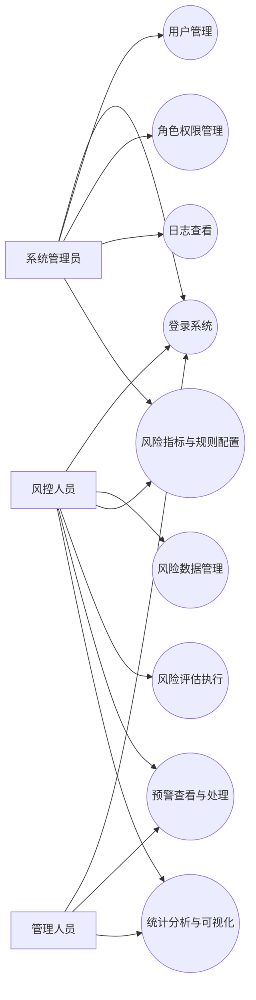
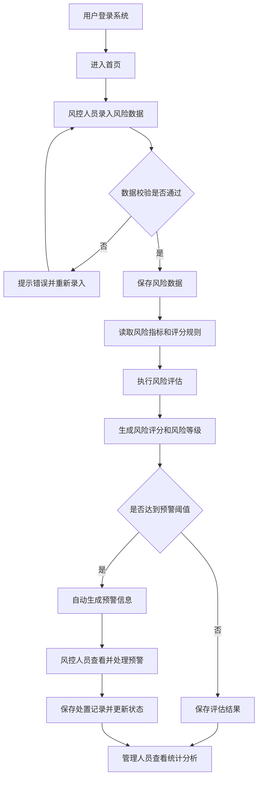
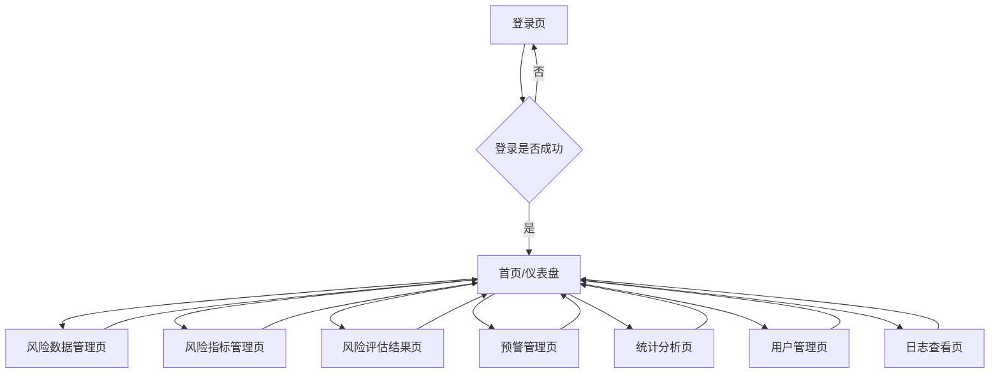
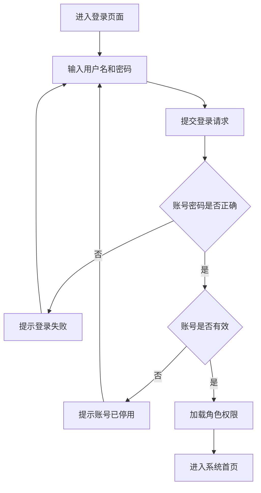
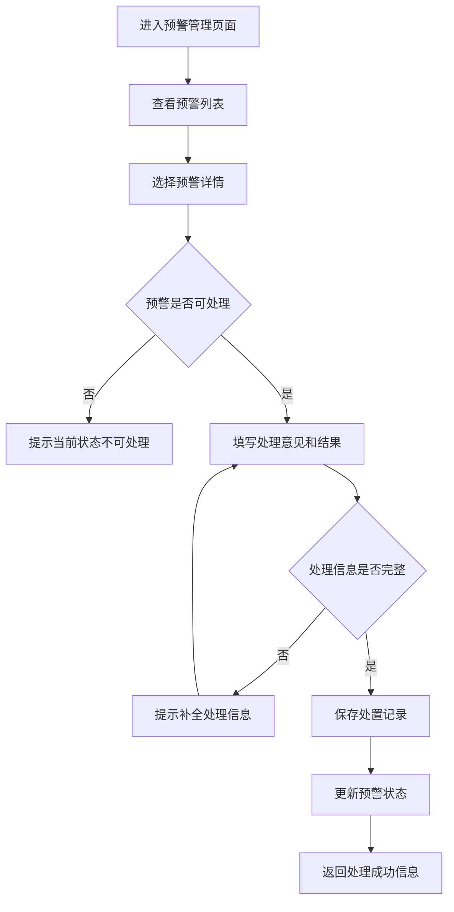
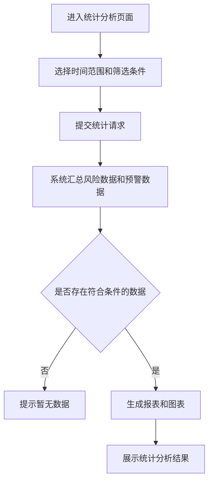

# 需求分析图示 Mermaid 代码

## 1. 用例图

```mermaid
flowchart LR
    Admin[系统管理员]
    RiskUser[风控人员]
    Manager[管理人员]

    Login((登录系统))
    UserMgr((用户管理))
    RoleMgr((角色权限管理))
    DataMgr((风险数据管理))
    RuleMgr((风险指标与规则配置))
    Assess((风险评估执行))
    Warning((预警查看与处理))
    Stats((统计分析与可视化))
    LogView((日志查看))

    Admin --> Login
    Admin --> UserMgr
    Admin --> RoleMgr
    Admin --> LogView
    Admin --> RuleMgr

    RiskUser --> Login
    RiskUser --> DataMgr
    RiskUser --> RuleMgr
    RiskUser --> Assess
    RiskUser --> Warning
    RiskUser --> Stats

    Manager --> Login
    Manager --> Warning
    Manager --> Stats
```

## 2. 核心业务流程图

```mermaid
flowchart TD
    A[用户登录系统] --> B[进入首页]
    B --> C[风控人员录入风险数据]
    C --> D{数据校验是否通过}
    D -- 否 --> E[提示错误并重新录入]
    E --> C
    D -- 是 --> F[保存风险数据]
    F --> G[读取风险指标和评分规则]
    G --> H[执行风险评估]
    H --> I[生成风险评分和风险等级]
    I --> J{是否达到预警阈值}
    J -- 否 --> K[保存评估结果]
    J -- 是 --> L[自动生成预警信息]
    L --> M[风控人员查看并处理预警]
    M --> N[保存处置记录并更新状态]
    K --> O[管理人员查看统计分析]
    N --> O
```

## 3. 页面流程图

```mermaid
flowchart TD
    A[登录页] --> B{登录是否成功}
    B -- 否 --> A
    B -- 是 --> C[首页/仪表盘]
    C --> D[风险数据管理页]
    C --> E[风险指标管理页]
    C --> F[风险评估结果页]
    C --> G[预警管理页]
    C --> H[统计分析页]
    C --> I[用户管理页]
    C --> J[日志查看页]
    D --> C
    E --> C
    F --> C
    G --> C
    H --> C
    I --> C
    J --> C
```

## 4. 用户登录流程图

```mermaid
flowchart TD
    A[进入登录页面] --> B[输入用户名和密码]
    B --> C[提交登录请求]
    C --> D{账号密码是否正确}
    D -- 否 --> E[提示登录失败]
    E --> B
    D -- 是 --> F{账号是否有效}
    F -- 否 --> G[提示账号已停用]
    G --> B
    F -- 是 --> H[加载角色权限]
    H --> I[进入系统首页]
```

## 5. 预警处理流程图

```mermaid
flowchart TD
    A[进入预警管理页面] --> B[查看预警列表]
    B --> C[选择预警详情]
    C --> D{预警是否可处理}
    D -- 否 --> E[提示当前状态不可处理]
    D -- 是 --> F[填写处理意见和结果]
    F --> G{处理信息是否完整}
    G -- 否 --> H[提示补全处理信息]
    H --> F
    G -- 是 --> I[保存处置记录]
    I --> J[更新预警状态]
    J --> K[返回处理成功信息]
```

## 6. 风险统计分析流程图

```mermaid
flowchart TD
    A[进入统计分析页面] --> B[选择时间范围和筛选条件]
    B --> C[提交统计请求]
    C --> D[系统汇总风险数据和预警数据]
    D --> E{是否存在符合条件的数据}
    E -- 否 --> F[提示暂无数据]
    E -- 是 --> G[生成报表和图表]
    G --> H[展示统计分析结果]
```
